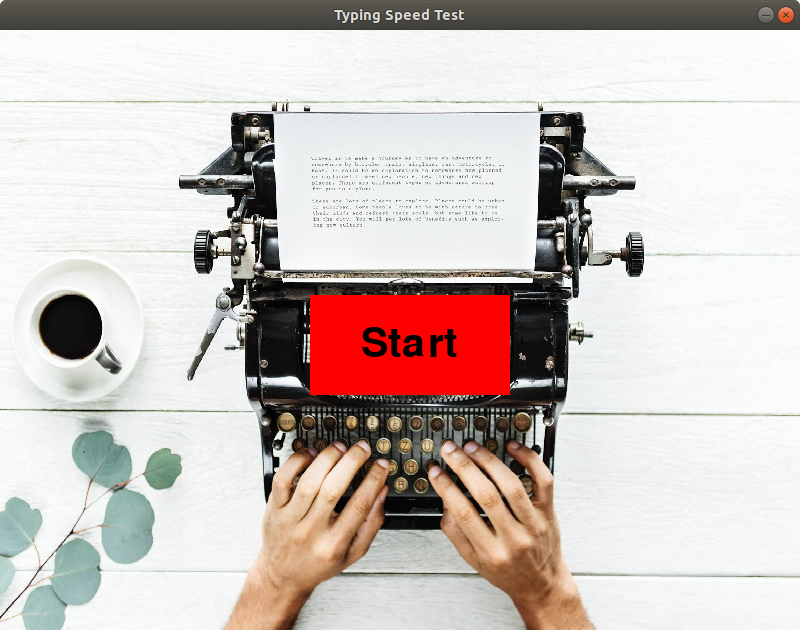
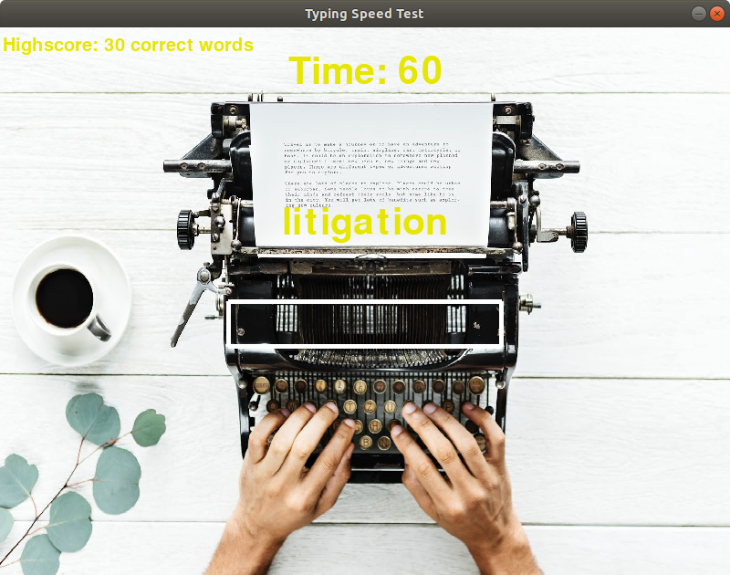
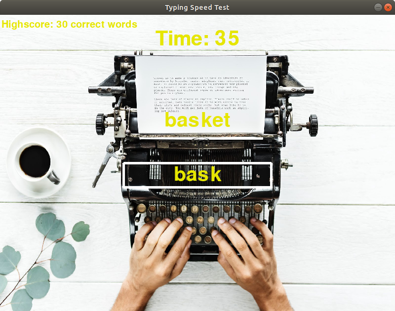
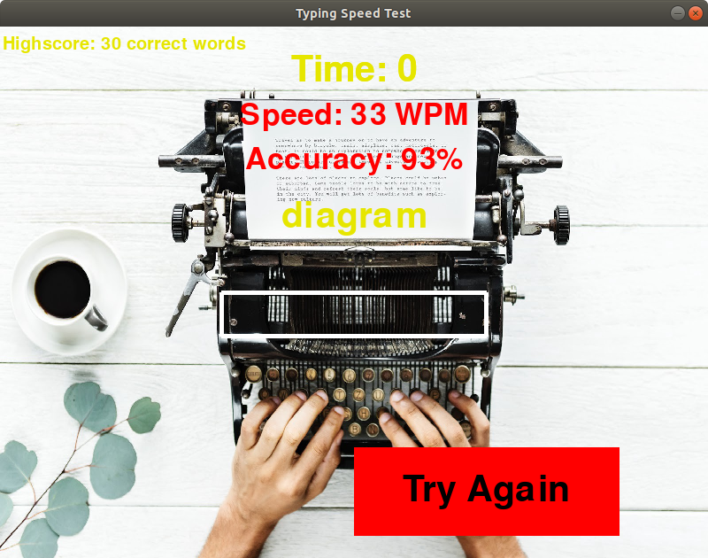

# Pygame-Typing-Speed-Test

__This is a Pygame-Typing-Speed-Test, a game that tests your typing skills.__

## Installation (on Ubuntu/Linux)

Before you run the game, you need to be sure you have installed Python3 and Pygame. In case you haven't, here are some simple instructions to follow: 

 1. Install Python3:  __`sudo apt-get install python3`__
 2. Install Pygame using:
  + __`sudo apt-get install python3-pip python3-dev`__
  + __`sudo pip3 install pygame`__
    
 

## Running the program (on Ubuntu/Linux)

There are few steps left before your journey begins. Make sure to follow the next steps: 

 1. Clone the repo: __`git clone https://github.com/razvanmatisan/Pygame-Typing-Speed-Test.git`__
 2. Go to the directory you cloned the repo (in your terminal)
 3. Use the command in terminal: __`python3 typing-speed-test.py`__

## How to test your typing skills - instructions

__Now you are ready to begin!__ 

### 1. On the screen title, press Start

### 2. Press inside the white rectangle to start the game

### 3. Write as many correct words as possible.
   HINT: Press ENTER after you finished to write the given word.

### 4. Check your results and try again if you want to improve your score.

## Creators

Many thanks to [Diana Maria Simion](https://github.com/dianasimion) and [Razvan-Andrei Matisan](https://github.com/razvanmatisan) for this wonderful project and finest accuracy!!!

## Contribution

We appreciate any contribution to this project. We are looking forward to improving our game by introducing these features:

+ database that keeps the names of the users and their highest results
+ time accuracy
+ choosing the countdown at the beginning of the game
+ updating the list of words regularly
